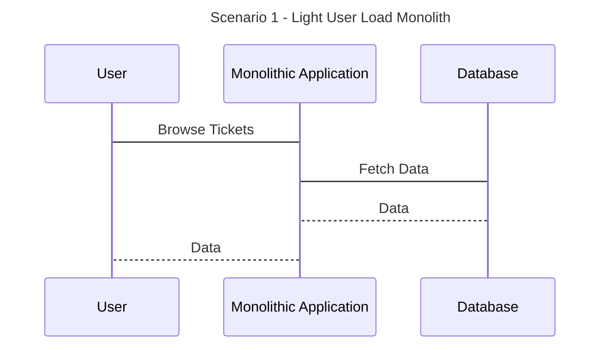
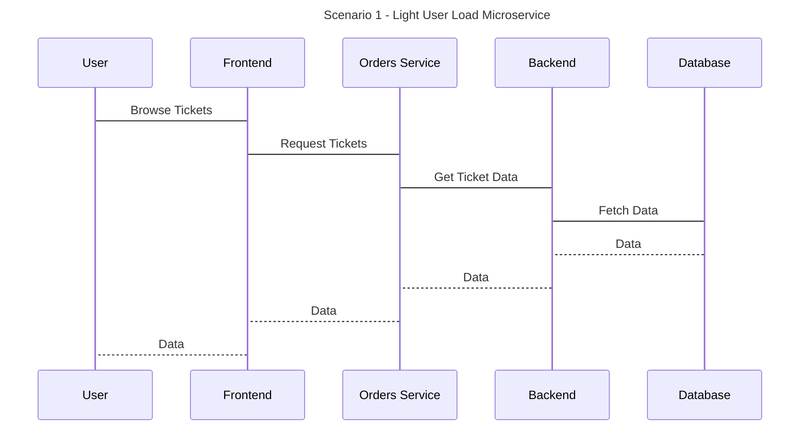
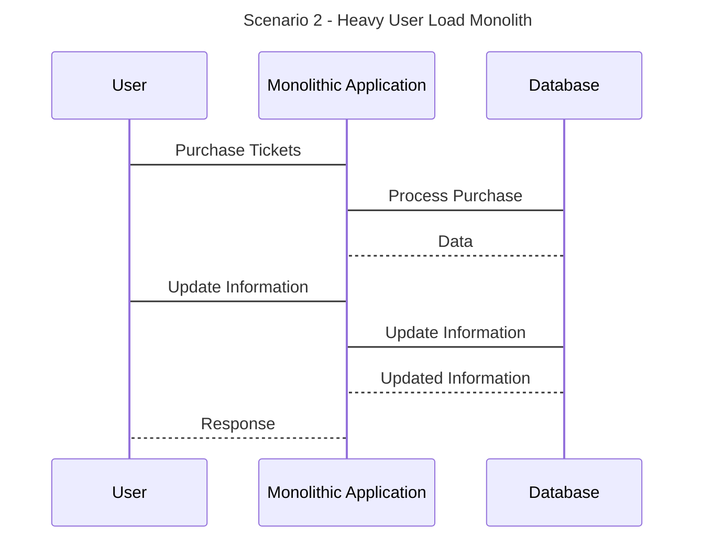
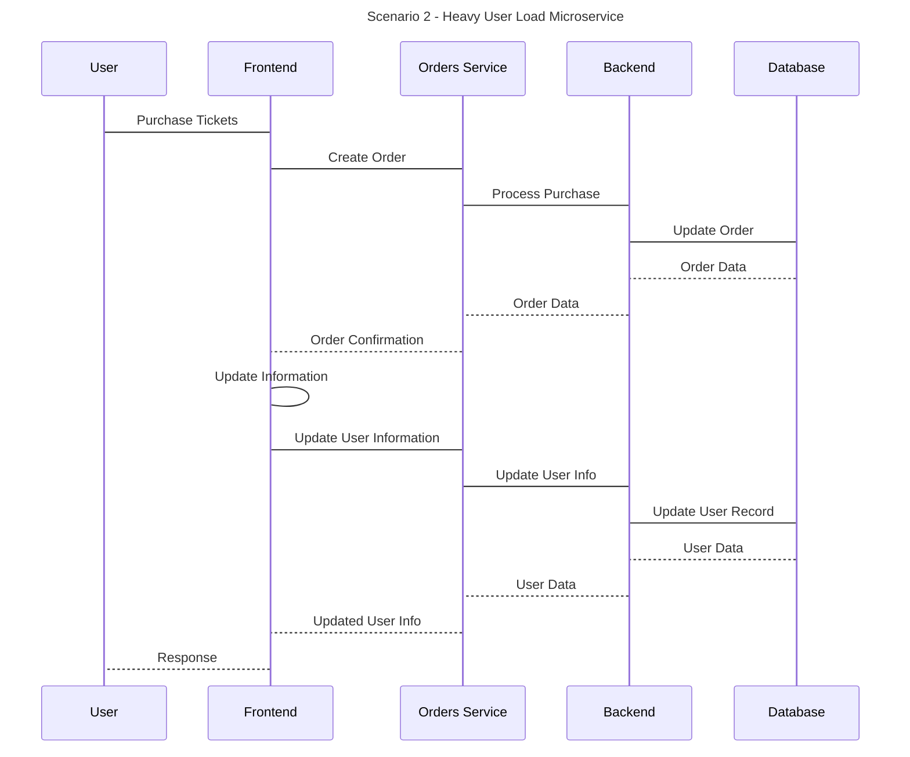
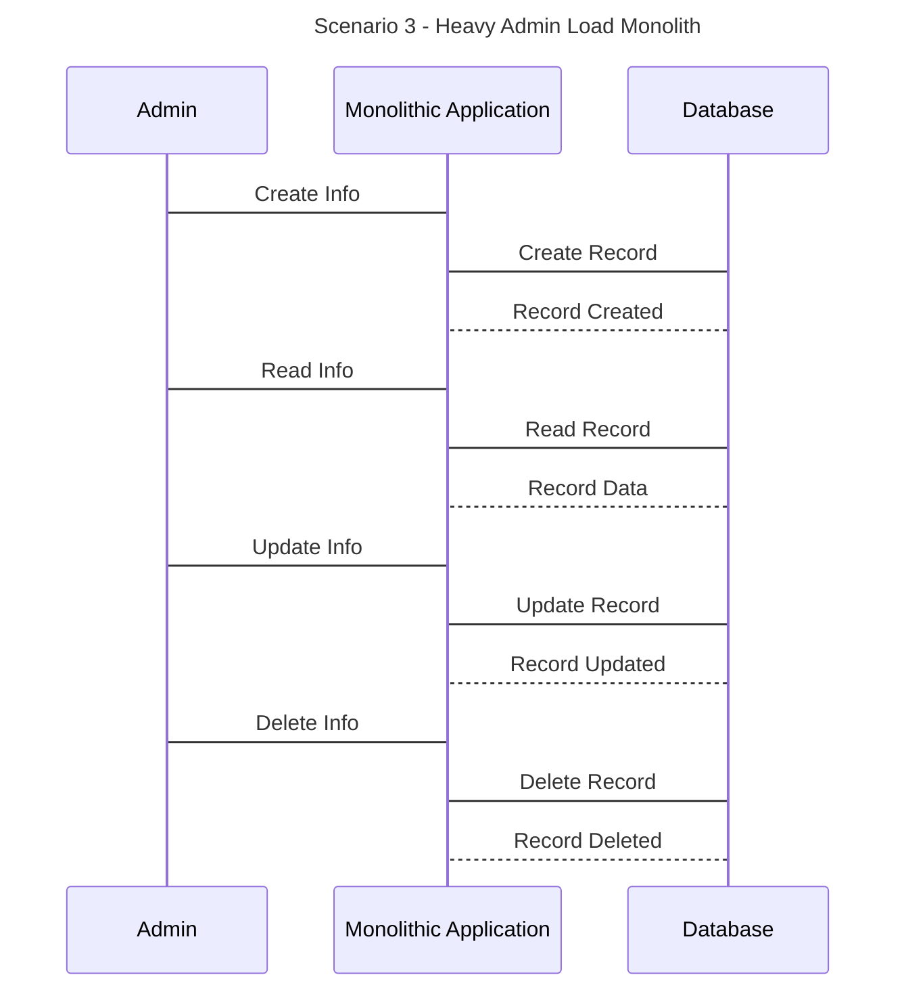
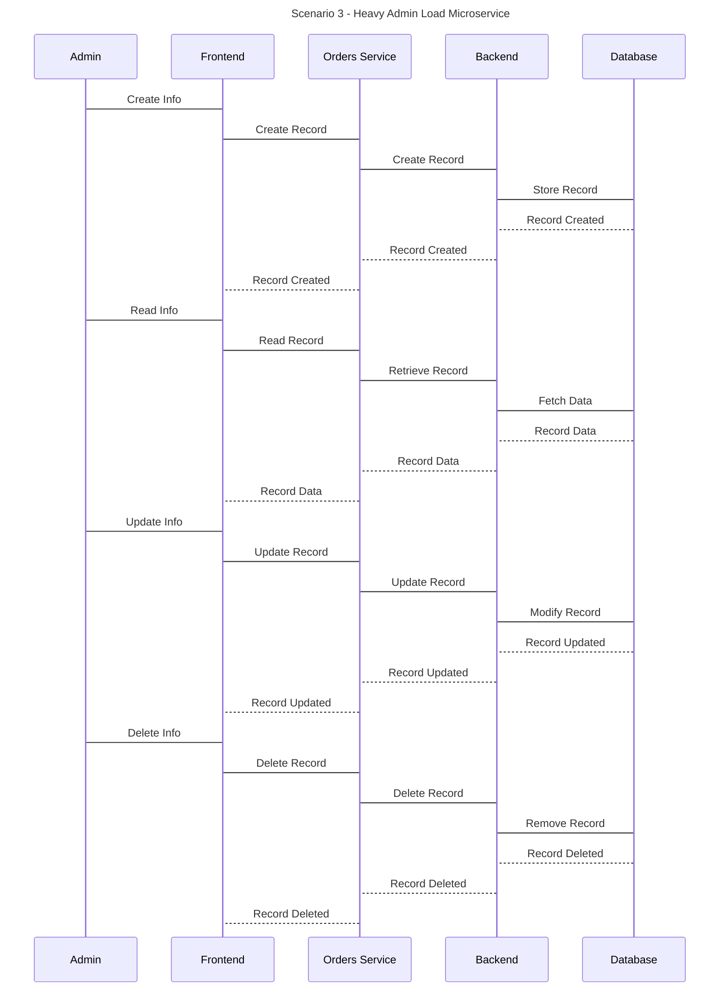
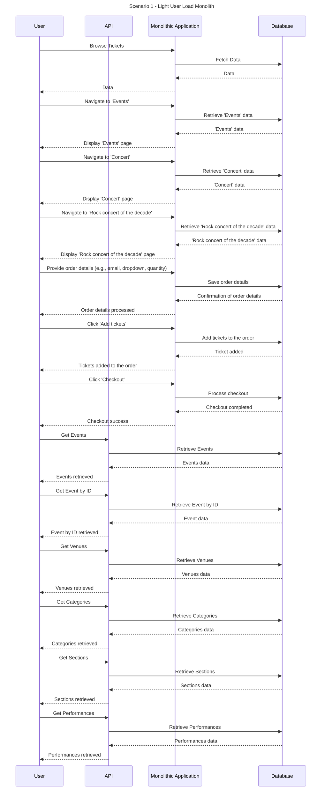
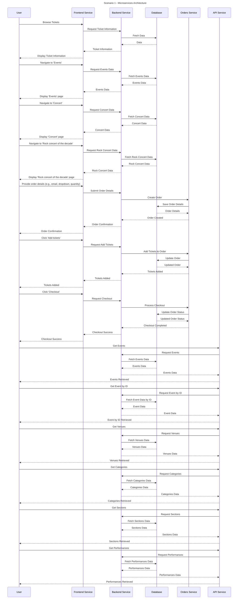
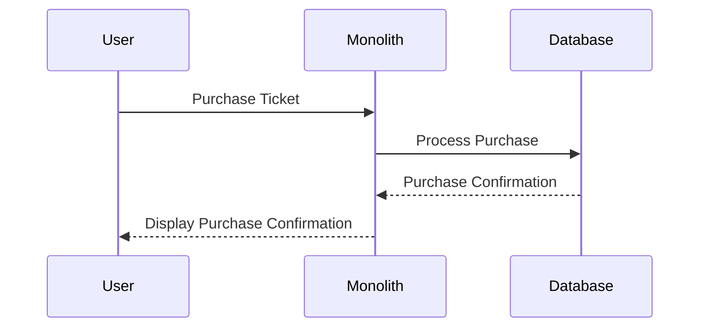
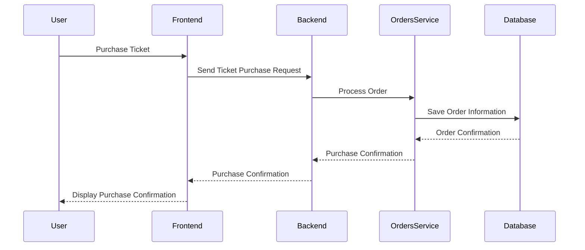

# 📈 Monolith vs. Microservices Power Consumption Comparison

This project contains both a monolith and micro-services version of the Ticket Monster application (forked from [ticket-monster-msa](https://github.com/ticket-monster-msa/monolith)), and is used to compare the power consumption of the two architectures.

## 🏗️ Project structure

The project is broken up into two parts: the monolith and the microservices. The monolith is located in the `monolith` folder, and the microservices are broken up between three folders:

- `tm-ui-v2` The UI for the microservices
- `backend-v2` The backend for the microservices
- `orders-service` The orders service for the microservices

## 🥅 Goal

The goal of this project is to compare the power consumption of the monolith and microservice architectures, using a collection of bash scripts that utilise [Selenium](https://www.selenium.dev/), [Docker](https://www.docker.com/), [Newman CLI](https://github.com/postmanlabs/newman) and the [Intel Power Gadget](https://www.intel.com/content/www/us/en/developer/articles/tool/power-gadget.html) API.

## 📒 Prerequisites

To run this project you will need the following installed on your system:

- [Docker](https://www.docker.com/)
- [Python](https://www.python.org/downloads/)
- [newman](https://github.com/postmanlabs/newman)
- [Intel Power Gadget](https://www.intel.com/content/www/us/en/developer/articles/tool/power-gadget.html)

## ✅ Getting started

To run this project you will need to complete the following steps:

1. Clone this repository to your local machine
2. Ensure all prerequisites are installed (See previous section)
3. You will need to provide two files for **each** architecture:
   - `frontend.yml` - Contains a list of instructions for Selenium to follow to navigate and execute tasks on the frontend
   - `workload.json` - Contains a list of instructions for Newman to follow to execute tasks on the backend (This can be generated using the Postman GUI, and exported to a JSON file)
   - You can see examples of both of these files in the `/workflows/scenario-1` directory.
4. Edit the `/workflows/experiment.yml` file with your workflow paths and various other settings.

> Steps 3 and 4 are only if you want to create your own experiment. The default configurations are already set up so you can skip these steps if you simply want to replicate!

5. Run `./benchmark.sh` to initiate the experiment. It will check that all dependencies are installed, and ask you to confirm the configuration before starting.

### 💻 Available Scripts

- `./benchmark.sh` Runs the entire experiment based on the configurations in the `/workflows/experiment.yml` file

- `./startup.sh  [--monolith | --microservice | --all]` Starts either the monolith or microservices containers based on the docker compose files
- `./shutdown.sh` Shuts down any running services
- `./paralell.sh` Used to debug parallel Chrome instances using Selenium at the same time
- `./monitor.sh [--monolith | --microservice] <duration (optional, defaults to 10s)> [--iterations <number of iterations (optional, defaults to 1)>]` Monitors the specified service for the specified number of iterations, and a specified duration (in seconds). The results are saved in the `output` folder
- `./prereq.sh --mono_frontend="/X" --mono_backend="/Y" --micro_frontend="/Z" --micro_backend="/J"` Well check the paths and configuration of your experiment setup, and will check all dependencies are installed

### Selenium Commands

Selenium can be tested separate of the entire experiment by navigating to the `selenium` directory and running the following command:

`python web_crawler.py microservice-config.yaml`

> Make sure you have the dependencies installed first `pip install -r dependencies.txt`

# UML Sequence Diagrams For each scenario

## Scenario 1

## Scenario 2

## Scenario 3

## Detailed Sequence Diagram - Scenario 1

## Some more sequence diagrams

