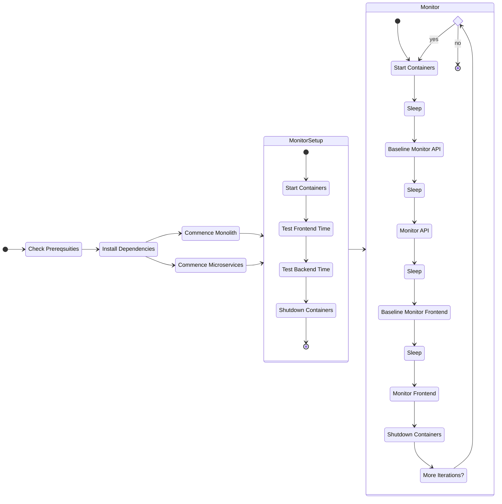

# 📈 Monolith vs. Microservices Power Consumption Comparison

This project contains both a monolith and micro-services version of the Ticket Monster application (forked from [ticket-monster-msa](https://github.com/ticket-monster-msa/monolith)), and is used to compare the power consumption of the two architectures.

## 🏗️ Project structure

The project is broken up into two parts: the monolith and the microservices. The monolith is located in the `monolith` folder, and the microservices are broken up between three folders:

- `tm-ui-v2` The UI for the microservices
- `backend-v2` The backend for the microservices
- `orders-service` The orders service for the microservices

## 🥅 Goal

The goal of this project is to compare the power consumption of the monolith and microservice architectures, using a bash script that utilises the [Docker Stats API](https://docs.docker.com/engine/api/v1.40/#operation/ContainerStats) to monitor the CPU usage of each running container, and subsequently to calculate the power consumption..

## ✅ Getting started

Two run either the monolith or the microservices, you will need to have Docker installed on your system. Various bash scripts have been created to `start`, `monitor` and `shutdown` both services.

### 💻 Available commands

- `./benchmark.sh --duration <duration> --iterations <iterations>` Runs the entire experiment for the specified duration (in seconds) and number of iterations. The results are saved in the `output` folder.

- `./startup.sh  [--monolith | --microservice | --all]` Starts either the monolith or microservices

- `./monitor.sh [--monolith | --microservice] <duration (optional, defaults to 10s)> [--iterations <number of iterations (optional, defaults to 1)>]` Monitors the specified service for the specified number of iterations, and a specified duration (in seconds). The results are saved in the `output` folder

- `./shutdown.sh` Shuts down any running services

### Useful commands for Dmon System

Using the `v1dmon` system, the following commands are useful:

- `go run dmon.go -i en0 -n bridge0 -f structure`
- `flow -f workflows/workflow.yml -o output`
- `./read_log.sh -f path_to_file.log` to see a cleaned up output of CPU usage by container

### Selenium Commands

Recently added selenium script can be run through instructed to navigate and perfrom actions on the website based on a yaml script. Can be run using the following command:

`python3 web_crawler.py microservice-config.yaml`

> Make sure you have the dependencies installed first `pip install -r dependencies.txt`

### State Diagram

